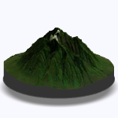
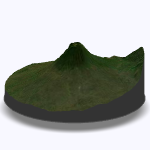
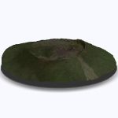

Render 3D vistas of Virunga for VolcanoView
================
ofr1t
2021-06-18

This script renders 3D vistas of the 8 volcanoes of the Virunga chain.
The vistas are used as illustrations in the VolcanoView webmap project.
The script makes use of the *rayvista* package.

``` r
require(tidyverse)
require(sf)
require(rayshader)
require(rayvista)
require(glue)
```

Point geometries and attributes (name and elevation) were acquired from
OpenStreetMap via the *osmdata* package.

``` r
virunga <- read_sf("../data/virunga.geojson") %>%
    mutate(lon = st_coordinates(.)[,1], lat = st_coordinates(.)[,2])

print(virunga)
```

    ## Simple feature collection with 8 features and 5 fields
    ## Geometry type: POINT
    ## Dimension:     XY
    ## Bounding box:  xmin: 29.20302 ymin: -1.521448 xmax: 29.67791 ymax: -1.383008
    ## Geodetic CRS:  WGS 84
    ## # A tibble: 8 x 6
    ##   osm_id    name          ele             geometry   lon   lat
    ## * <chr>     <chr>       <dbl>          <POINT [°]> <dbl> <dbl>
    ## 1 309204570 Karisimbi    4507 (29.45132 -1.507015)  29.5 -1.51
    ## 2 309204564 Mikeno       4437 (29.41977 -1.464611)  29.4 -1.46
    ## 3 309205852 Muhabura     4127 (29.67791 -1.383008)  29.7 -1.38
    ## 4 310987482 Bisoke       3711 (29.48492 -1.458824)  29.5 -1.46
    ## 5 309205255 Sabyinyo     3645  (29.59131 -1.38964)  29.6 -1.39
    ## 6 310988033 Gahinga      3474 (29.64515 -1.386418)  29.6 -1.39
    ## 7 309205211 Nyiragongo   3470 (29.24995 -1.521448)  29.2 -1.52
    ## 8 435509578 Nyamuragira  3058  (29.20302 -1.41227)  29.2 -1.41

This function plots a 3D vista of an individual volcano and renders a
PNG snapshot:

``` r
render_volcano_vista = function(volcano, name) {
    
    vista <- plot_3d_vista(
        lat = volcano$lat, lon = volcano$lon,
        baseshape = "circle", radius = volcano$ele*.6,
        phi = 20, theta = 0, zscale = 5, zoom = .6,
        background = "#F8F8FF",
        windowsize = 150
    )

    render_snapshot(filename = glue("../img/{name}.png"), clear = TRUE)
    
    # image_read(target) %>%
    #   image_transparent("white", fuzz = 30) %>%
    #   image_write(target)
    
}
```

Iterate the rendering function over all 8 volcanoes:

``` r
volcano <- virunga %>% 
    group_by(name) %>%
    group_walk(render_volcano_vista)
```

Resulting images:


